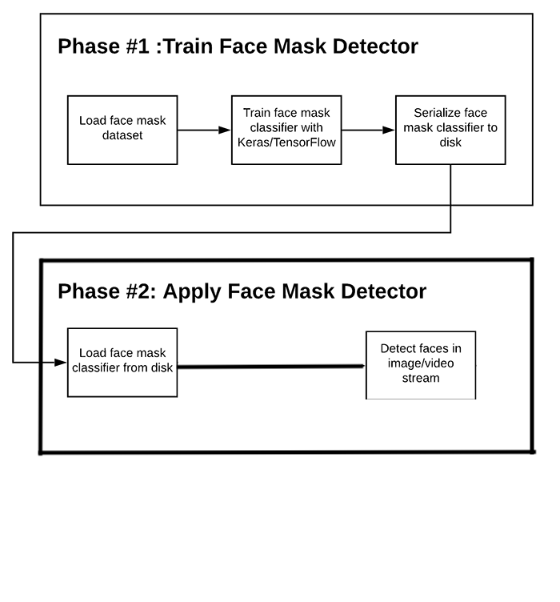

# RealTimeMaskDetector

Live Program detecting if user is wearing mask.

System is detecting a person and, based on trained images, decides, if mask is worn on face.

Images used from Kaggle dataset:
https://data-flair.training/blogs/download-face-mask-data/

Used technologies:
  - Python
  - Keras
  - scikit-learn
  - Numpy

  
## *
  - depanding on data, might not work with all colors of masks (in this case, bright colors where used)
  - `model.py` code might work better in Jupyter Notebook

  ## How to run
  1. Download dataset from `dataset_link.txt`
  2. `model.py` 
    - Line 35 – change `TRAINING_DIR` to location of train set  
    - Line 48 – change `VALIDATION_DIR` to location of test set
  3. Run in order to get model
  4. `RunApp.py` 
    - Line 4 - change `('.../model2-007.model')` location to local location of model 
    - Line 13 - change `('.../haarcascade_frontalface_default.xml')` location to local location of .xml file
  5. Open Terminal/Command prompt and do following: 
    - >>> cd ''location of RunApp.py'' 
    - >>> `python3 RunApp.py`
