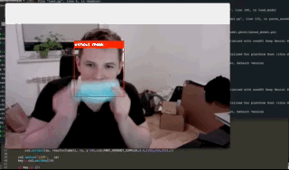

# RealTimeMaskDetector

Live Program detecting if user is wearing mask.

System is detecting a person and, based on trained images, decides, if mask is worn on face.

Used technologies:
  - Python
  - Keras
  - scikit-learn
  - Numpy
  
## *
  - depanding on data, might not work with all colors of masks (in this case, bright colors where used)
  - `model.py` code might work better in Jupyter Notebook

  ## How to run
  1. Download dataset from `dataset_link.txt`
  2. `model.py`
    - Line 35 – change `TRAINING_DIR` to local location of train set
    - Line 48 – change `VALIDATION_DIR` to local location of test set
  3. Run in order to get model
  4. `RunApp.py`
    - Line 4 - change `('.../model2-007.model')` location to local location of model
    - Line 13 - change `('.../haarcascade_frontalface_default.xml')` location to local location of .xml file
  5. Open Terminal/Command prompt and do following:
    - >>> cd `location of RunApp.py`
    - >>> python RunApp.py
